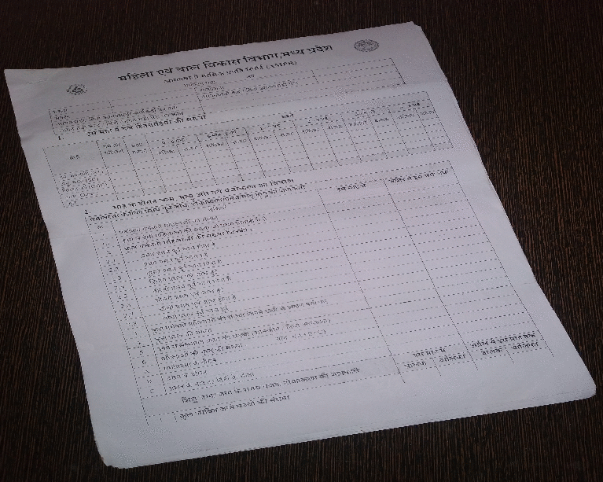

# Interface to scan documents from Images

Functionality:-

* Automatic Page contour detection (for cases which have complete page in image bounds)
* Bounding box with free moving corners and parallelly moving edges
* Perspective transformation to obtain top-view image

Dependencies:-

* numpy
* opencv-python

#### To use 
clone the repo locally.
```
git clone https://github.com/SarthakTiwari/Paper-Page-Scanner.git
```
set project root folder as current working directory 

Make sure you have above mentioned dependencies installed on machine.
if not then create a new environment and activate it
install dependencies
```
pip install -r requirements.txt
```
run page_selection.py 
```
python page_selection.py -in input_image.format -out output_image.desired_format
```
#### Demo



